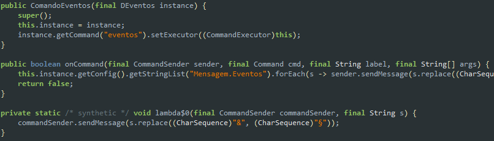
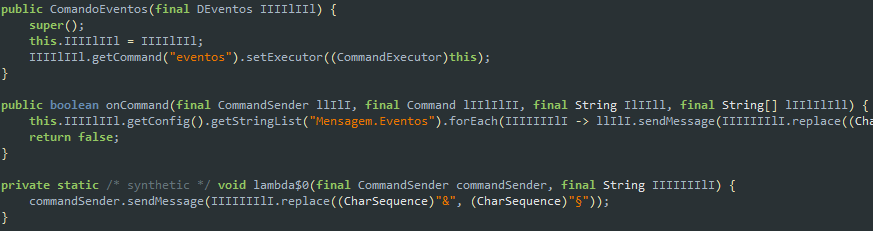

This is a very simple project. I did it during a live.

I didn't worry about a beautiful design or something user friendly, just the typescript / javascript code and the main functionality of the app, which is obfuscating .jar files

## Prints
##### Before

##### After

# What does it do?
For now, it only obfuscate inner method variables. I think about expanding it and making it more robust.

# Credits
[Next.js](https://nextjs.org) and [React](https://reactjs.org)
[Java Class Tools](https://github.com/leonardosnt/java-class-tools) (thanks LeonardoSNT again)